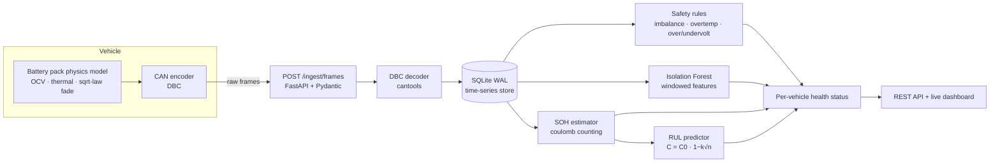

# ⚡ VoltIQ — EV Battery Intelligence Platform

[](https://github.com/AravindB98/voltiq/actions)
[](https://www.python.org/)
[](LICENSE)

**End-to-end battery health monitoring for EV fleets: raw CAN bus frames in, actionable fleet intelligence out.**

VoltIQ ingests the exact data an EV telematics unit uploads — raw 8-byte CAN frames — decodes them against a DBC file, and runs a battery analytics pipeline that answers the three questions every EV fleet operator asks:

1. **Is any battery misbehaving right now?** → two-layer anomaly detection (safety rules + Isolation Forest)
2. **How healthy is each pack?** → State of Health estimated from ordinary driving data via partial-discharge coulomb counting
3. **How long until it needs replacement?** → Remaining Useful Life extrapolated from each vehicle's own capacity-fade trend, with uncertainty bounds

```
$ voltiq demo
  simulated 5YJ3E1EA0PF000001: 117,000 frames
  ...
  5YJ3E1EA0PF000001: status=healthy   soh=96.08%  rul=560.5 cycles  alerts=0
  5YJ3E1EA0PF000004: status=critical  soh=89.01%  rul=799.5 cycles  alerts=152   ← weak cell caught
  5YJ3E1EA0PF000005: status=watch     anomaly_rate=33.7%                         ← cooling fault caught by ML
```

## Architecture



Every layer speaks the same contract as a production stack: the simulator doesn't hand the pipeline convenient floats — it encodes real CAN payloads through the same DBC file the decoder uses, so the entire path (bit packing, scaling, signedness, out-of-range handling, unknown arbitration IDs) is exercised exactly as it would be on a vehicle.

## Quick start

```bash
git clone https://github.com/AravindB98/voltiq && cd voltiq
pip install -e ".[dev]"

voltiq demo          # simulate a 5-vehicle fleet (1 year), ingest, analyze  (~30 s)
voltiq serve         # dashboard + API at http://localhost:8000
```

Or with Docker:

```bash
docker build -t voltiq . && docker run -p 8000:8000 voltiq
```

The demo fleet includes three healthy vehicles with different usage patterns and two seeded faults the analytics must catch: a **weak cell** that progressively sags (detected by imbalance rules → `critical`) and a **degraded cooling loop** (never violates a hard limit — only the Isolation Forest sees it → `watch`).

## What's inside

### 1. Physics-based battery simulator (`voltiq/simulator/`)
A steppable NMC pack model: piecewise OCV–SOC curve, internal resistance that grows with age and cold, lumped thermal model (Joule heating vs convective cooling), capacity fade following the empirical square-root-of-throughput law, and age-widening cell imbalance. Drive/charge cycles emit CAN frames through the DBC codec. Fault injection is first-class: `--fault weak_cell`, `--fault cooling_degraded`.

### 2. CAN layer (`voltiq/decoder/`, `voltiq/data/voltiq_bms.dbc`)
Four BMS messages (PackStatus, CellStats, Temps, Energy) defined in a standard DBC file and codec'd with `cantools`. One source of truth shared by simulator, ingestion, and tests — the same discipline that keeps real BMS/telematics stacks in sync.

### 3. Ingestion (`voltiq/ingest/`)
Validated batch ingestion (Pydantic v2) → decode → SQLite in WAL mode. Unknown arbitration IDs are counted, not fatal (a real bus is full of other ECUs' chatter). The `Store` API is narrow by design so the backend can be swapped for TimescaleDB/ClickHouse without touching callers.

### 4. Analytics (`voltiq/analytics/`)
* **Safety rules** mirror BMS hard limits (cell over/under-voltage, imbalance ladder, over-temperature) with per-code debouncing so a persistent fault produces a readable alert trail, not 8,000 duplicates.
* **Isolation Forest** per vehicle, trained on that vehicle's own early history, over windowed features (cell spread, ambient-relative self-heating, |current|, pack voltage). Ambient-relative temperature is used deliberately — seasons are not anomalies.
* **SOH**: `C_est = ∫I dt / ΔSOC` over discharge segments of ordinary drives — no reference discharge needed. Segments split on telemetry gaps (integrating across a parked night would inflate capacity), median-filtered to a trend.
* **RUL**: the fade law `C(n) = C0(1 − k√n)` linearises to a one-parameter regression, fitted to each vehicle's capacity history; solve for the 80 %-SOH crossing, convert remaining cycles to km and days using the vehicle's observed usage rate, and report a 1-σ band from fit residuals.

### 5. API + dashboard (`voltiq/api/`, `voltiq/dashboard/`)
FastAPI with OpenAPI docs at `/docs`, and a zero-build dark-mode dashboard (Chart.js) showing fleet status cards, per-vehicle SOH/RUL table, telemetry charts, and the alert feed.

| Endpoint | Purpose |
|---|---|
| `POST /api/v1/ingest/frames` | Batch CAN frame ingestion (validated, hex payloads) |
| `POST /api/v1/analytics/run` | Run the full analytics pipeline |
| `GET /api/v1/fleet` | Fleet summary with per-vehicle health |
| `GET /api/v1/vehicles/{vin}/health` | SOH, RUL, status for one vehicle |
| `GET /api/v1/vehicles/{vin}/alerts` | Alert history |
| `GET /api/v1/vehicles/{vin}/telemetry` | Downsampled decoded signal series |
| `GET /healthz` | Liveness + row count |

## Verification

27 tests cover the physics model (SOC bounds, fade monotonicity, thermal behaviour), DBC round-trips (including negative temperatures and out-of-range rejection), the analytics math (SOH recovers a known capacity within 5 %; RUL recovers the fade constant `k` within 1e-3 from synthetic sqrt-law data; Isolation Forest flags an injected regime shift concentrated in the right time region), and the full HTTP flow (simulate → ingest → analyze → query; malformed frames rejected with 422). CI runs lint + tests + an end-to-end demo on Python 3.10–3.12.

```bash
pytest -v          # run the suite
ruff check .       # lint
```

## Design decisions & honest limitations

* **SQLite over Timescale/Kafka** — the repo must run anywhere with `pip install`. The ingestion and storage interfaces are the seams where Kafka and a columnar TSDB would slot in at fleet scale.
* **Simulated data over real logs** — real OEM CAN logs are proprietary. The simulator is physics-grounded (OCV curve, sqrt-fade law, thermal model) and, critically, produces *raw encoded frames*, so no component ever touches "convenient" data.
* **Per-vehicle anomaly baselines** — a fleet-level model would conflate usage patterns; each vehicle learning its own normal is what production battery-health teams converge on.
* Not implemented (deliberately out of scope): auth, multi-tenant partitioning, schema migrations, model registry. Each is an interface away, not a rewrite.

## License

MIT — see [LICENSE](LICENSE).

---

Built by **Aravind Balaji** · aravindo2011@gmail.com
