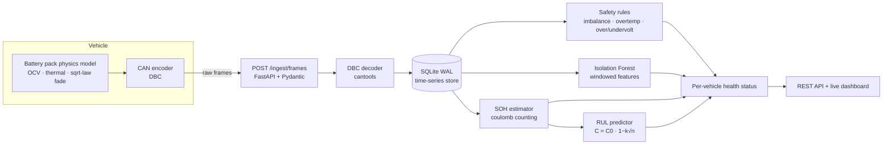

# ⚡ VoltIQ — EV Battery Intelligence Platform

[](https://github.com/AravindB98/voltiq/actions)
[](https://www.python.org/)
[](LICENSE)

**End-to-end battery health monitoring for EV fleets: raw CAN bus frames in, actionable fleet intelligence out.**

VoltIQ ingests the exact data an EV telematics unit uploads — raw 8-byte CAN frames — decodes them against a DBC file, and runs a battery analytics pipeline that answers the three questions every EV fleet operator asks:

1. **Is any battery misbehaving right now?** → two-layer anomaly detection (safety rules + Isolation Forest)
2. **How healthy is each pack?** → State of Health estimated from ordinary driving data via partial-discharge coulomb counting
3. **How long until it needs replacement?** → Remaining Useful Life extrapolated from each vehicle's own capacity-fade trend, with uncertainty bounds

```
$ voltiq demo
  simulated 5YJ3E1EA0PF000001: 117,000 frames
  ...
  5YJ3E1EA0PF000001: status=healthy   soh=96.08%  rul=560.5 cycles  alerts=0
  5YJ3E1EA0PF000004: status=critical  soh=89.01%  rul=799.5 cycles  alerts=152   ← weak cell caught
  5YJ3E1EA0PF000005: status=watch     anomaly_rate=33.7%                         ← cooling fault caught by ML
```

## Architecture



Every layer speaks the same contract as a production stack: the simulator doesn't hand the pipeline convenient floats — it encodes real CAN payloads through the same DBC file the decoder uses, so the entire path (bit packing, scaling, signedness, out-of-range handling, unknown arbitration IDs) is exercised exactly as it would be on a vehicle.

## How to reproduce & run

Everything below is fully reproducible on any machine with Python 3.10+ (Linux, macOS, or Windows). No external services, no API keys, no datasets to download — the physics simulator generates the data.

**1. Clone and install**

```bash
git clone https://github.com/AravindB98/voltiq.git
cd voltiq
python -m venv .venv && source .venv/bin/activate   # Windows: .venv\Scripts\activate
pip install -e ".[dev]"
```

**2. Seed a demo fleet** (5 vehicles, 1 year of telemetry, ~660k CAN-decoded rows, ~30 s)

```bash
voltiq demo
```

You should see three healthy vehicles, one flagged `critical` (weak cell caught by imbalance rules) and one flagged `watch` (cooling fault caught only by the Isolation Forest). Simulation is seeded, so results are deterministic.

**3. Launch the dashboard and API**

```bash
voltiq serve
# Dashboard  → http://localhost:8000
# OpenAPI    → http://localhost:8000/docs
```

**4. Run the verification suite**

```bash
pytest -v            # 27 tests: physics, CAN round-trips, analytics math, HTTP flow
ruff check .         # lint
```

**5. Experiment** — simulate your own scenarios and re-analyze:

```bash
voltiq simulate --vin MYTESTVIN0000001 --days 200 --daily-km 90 \
                --fault weak_cell --fault-day 100
voltiq analyze
```

**Docker (one command, zero setup):**

```bash
docker build -t voltiq . && docker run -p 8000:8000 voltiq
```

## Tech stack

| Layer | Technology | Why |
|---|---|---|
| CAN encoding/decoding | **cantools** + standard **DBC** file | The exact toolchain automotive teams use for CAN matrices |
| API & validation | **FastAPI** + **Pydantic v2** | Typed request contracts, auto-generated OpenAPI docs |
| Storage | **SQLite (WAL)** | Zero-service reproducibility; interface designed for TimescaleDB/ClickHouse swap |
| ML | **scikit-learn** (Isolation Forest) + **NumPy** | Per-vehicle unsupervised anomaly baselines; least-squares fade fitting |
| Dashboard | **Chart.js**, zero-build static HTML | No frontend toolchain needed to run the project |
| Quality | **pytest**, **ruff**, **GitHub Actions** (Python 3.10–3.12), **Docker** | CI-verified on every push |

## Practical applications

The pipeline in this repo is a working blueprint for problems that battery-powered fleets deal with daily:

* **Warranty & residual-value analytics** — SOH estimated from ordinary driving data (no reference discharge) is how OEMs assess degradation across a fleet without recalling vehicles.
* **Predictive maintenance** — RUL with uncertainty bounds turns "the battery will fail eventually" into "schedule replacement in ~N months", which is what fleet operators actually budget against.
* **Early fault detection** — the weak-cell and cooling-degradation scenarios mirror two of the most common real failure modes; catching them before a hard BMS limit trips is the difference between a service visit and a roadside event.
* **Second-life battery grading** — the same capacity-fade history that feeds RUL is the input for deciding whether a retired pack goes to stationary storage or recycling.
* **Telematics backend prototyping** — the ingest → decode → store → analyze path is the reference shape of any vehicle data platform; every interface here is a seam where production infrastructure (Kafka, TimescaleDB, a model registry) slots in.

**Who is this relevant for?** EV OEMs (Tesla, Rivian, Lucid, BYD, VinFast, and the EV programs at legacy automakers), battery manufacturers and BMS suppliers (CATL, LG Energy Solution, Northvolt-style cell makers), commercial fleet operators and leasing companies, EV charging networks, battery-analytics startups, and second-life/recycling companies — plus anyone learning how battery telemetry systems fit together end to end.

## How companies can use this code

VoltIQ is structured so that every simulated component has an obvious real-world replacement. A team adopting it would proceed in five steps, none of which requires touching the analytics:

**1. Swap in your CAN matrix.** Replace `voltiq/data/voltiq_bms.dbc` with your vehicle's DBC release (or pass a path to `DbcCodec`). The decoder, ingestion, and storage layers are signal-name driven — map your pack/cell/temperature signal names in `AnalyticsEngine` and everything downstream works unchanged.

**2. Point real telemetry at the ingest API.** `POST /api/v1/ingest/frames` already accepts exactly what a telematics unit produces: VIN, timestamp, arbitration ID, raw hex payload. A gateway forwarding CAN frames from vehicles (or a batch loader replaying `.blf`/`.asc`/MDF log files) is a thin adapter away. Unknown IDs are counted and skipped, so you can feed it the whole bus without pre-filtering.

**3. Scale the storage seam.** The entire persistence contract is the ~10-method `Store` class (`voltiq/ingest/store.py`). Implementing it against TimescaleDB, ClickHouse, or your data lake is an afternoon's work; no analytics or API code changes. Likewise, batch HTTP ingestion swaps for a Kafka consumer by reusing `IngestPipeline` as-is.

**4. Calibrate to your chemistry.** `PackConfig` holds the physical assumptions (cell count, rated capacity, EOL threshold, fade constant); the OCV curve and thresholds in `anomaly.py` are data, not logic. Fit them from your cell characterization data and warranty policy.

**5. Operationalize the outputs.** `voltiq analyze` is a stateless batch job — schedule it (Airflow/cron), and route the alerts table into your existing incident tooling via webhook. The `/api/v1/fleet` endpoint is ready to back an internal ops dashboard, or feed SOH/RUL directly into warranty-reserve and residual-value models.

Beyond direct adoption, the simulator alone is useful on its own: it generates unlimited labeled fault data (weak cell, cooling degradation, with ground-truth SOH) for benchmarking battery-health algorithms — something real fleets can rarely provide because faults are thankfully rare and ground truth requires teardown.

## Contributing

VoltIQ is open source (MIT) and contributions are very welcome!

⭐ **If this project is useful to you, please star the repo** — it genuinely helps others discover it.
🍴 **Fork it** and make it your own: swap in a real CAN log, point it at a different chemistry's OCV curve, or wire the ingest API to real hardware.

To contribute:

1. **Fork** the repository and create a feature branch: `git checkout -b feat/my-improvement`
2. Make your change, keeping the checks green: `pytest -v && ruff check .`
3. Add tests for new behaviour — the CI runs the full suite plus an end-to-end demo on Python 3.10–3.12.
4. Open a **pull request** with a clear description of what and why.

Good first contributions: additional fault scenarios (sensor stuck-at, contactor issues), an LFP OCV curve, Kalman-filter SOC estimation, a TimescaleDB storage backend, MQTT ingestion, or dashboard improvements. Found a bug or have an idea? [Open an issue](https://github.com/AravindB98/voltiq/issues) — see [CONTRIBUTING.md](CONTRIBUTING.md) for details.

## What's inside

### 1. Physics-based battery simulator (`voltiq/simulator/`)
A steppable NMC pack model: piecewise OCV–SOC curve, internal resistance that grows with age and cold, lumped thermal model (Joule heating vs convective cooling), capacity fade following the empirical square-root-of-throughput law, and age-widening cell imbalance. Drive/charge cycles emit CAN frames through the DBC codec. Fault injection is first-class: `--fault weak_cell`, `--fault cooling_degraded`.

### 2. CAN layer (`voltiq/decoder/`, `voltiq/data/voltiq_bms.dbc`)
Four BMS messages (PackStatus, CellStats, Temps, Energy) defined in a standard DBC file and codec'd with `cantools`. One source of truth shared by simulator, ingestion, and tests — the same discipline that keeps real BMS/telematics stacks in sync.

### 3. Ingestion (`voltiq/ingest/`)
Validated batch ingestion (Pydantic v2) → decode → SQLite in WAL mode. Unknown arbitration IDs are counted, not fatal (a real bus is full of other ECUs' chatter). The `Store` API is narrow by design so the backend can be swapped for TimescaleDB/ClickHouse without touching callers.

### 4. Analytics (`voltiq/analytics/`)
* **Safety rules** mirror BMS hard limits (cell over/under-voltage, imbalance ladder, over-temperature) with per-code debouncing so a persistent fault produces a readable alert trail, not 8,000 duplicates.
* **Isolation Forest** per vehicle, trained on that vehicle's own early history, over windowed features (cell spread, ambient-relative self-heating, |current|, pack voltage). Ambient-relative temperature is used deliberately — seasons are not anomalies.
* **SOH**: `C_est = ∫I dt / ΔSOC` over discharge segments of ordinary drives — no reference discharge needed. Segments split on telemetry gaps (integrating across a parked night would inflate capacity), median-filtered to a trend.
* **RUL**: the fade law `C(n) = C0(1 − k√n)` linearises to a one-parameter regression, fitted to each vehicle's capacity history; solve for the 80 %-SOH crossing, convert remaining cycles to km and days using the vehicle's observed usage rate, and report a 1-σ band from fit residuals.

### 5. API + dashboard (`voltiq/api/`, `voltiq/dashboard/`)
FastAPI with OpenAPI docs at `/docs`, and a zero-build dark-mode dashboard (Chart.js) showing fleet status cards, per-vehicle SOH/RUL table, telemetry charts, and the alert feed.

| Endpoint | Purpose |
|---|---|
| `POST /api/v1/ingest/frames` | Batch CAN frame ingestion (validated, hex payloads) |
| `POST /api/v1/analytics/run` | Run the full analytics pipeline |
| `GET /api/v1/fleet` | Fleet summary with per-vehicle health |
| `GET /api/v1/vehicles/{vin}/health` | SOH, RUL, status for one vehicle |
| `GET /api/v1/vehicles/{vin}/alerts` | Alert history |
| `GET /api/v1/vehicles/{vin}/telemetry` | Downsampled decoded signal series |
| `GET /healthz` | Liveness + row count |

## Verification

27 tests cover the physics model (SOC bounds, fade monotonicity, thermal behaviour), DBC round-trips (including negative temperatures and out-of-range rejection), the analytics math (SOH recovers a known capacity within 5 %; RUL recovers the fade constant `k` within 1e-3 from synthetic sqrt-law data; Isolation Forest flags an injected regime shift concentrated in the right time region), and the full HTTP flow (simulate → ingest → analyze → query; malformed frames rejected with 422). CI runs lint + tests + an end-to-end demo on Python 3.10–3.12.

```bash
pytest -v          # run the suite
ruff check .       # lint
```

## Design decisions & honest limitations

* **SQLite over Timescale/Kafka** — the repo must run anywhere with `pip install`. The ingestion and storage interfaces are the seams where Kafka and a columnar TSDB would slot in at fleet scale.
* **Simulated data over real logs** — real OEM CAN logs are proprietary. The simulator is physics-grounded (OCV curve, sqrt-fade law, thermal model) and, critically, produces *raw encoded frames*, so no component ever touches "convenient" data.
* **Per-vehicle anomaly baselines** — a fleet-level model would conflate usage patterns; each vehicle learning its own normal is what production battery-health teams converge on.
* Not implemented (deliberately out of scope): auth, multi-tenant partitioning, schema migrations, model registry. Each is an interface away, not a rewrite.

## License

MIT — see [LICENSE](LICENSE).

---

Built by **[Aravind Balaji](https://aravindbalaji.com)** · [aravindbalaji.com](https://aravindbalaji.com)
